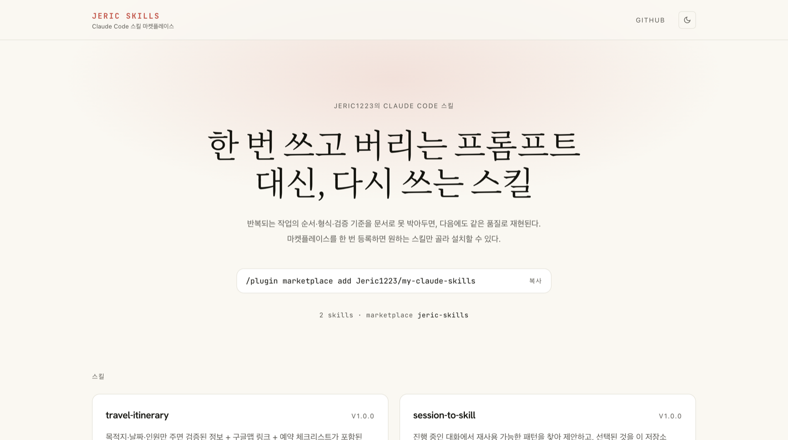
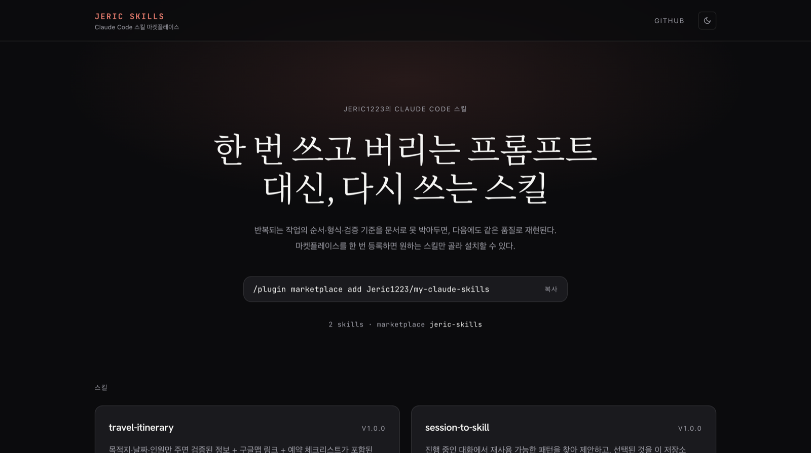

<div align="center">

# Jeric Skills

**[my-claude-skills](https://github.com/Jeric1223/my-claude-skills) 마켓플레이스에 등록된 Claude Code 스킬을 보여주는 쇼케이스 사이트**

**[my-claude-skills-site.vercel.app →](https://my-claude-skills-site.vercel.app)**

Next.js 16 · Tailwind CSS v4 · TypeScript





</div>

---

## 데이터가 어디서 오나

이 저장소에는 스킬 내용이 **한 줄도 없다.** 빌드 시점에 스킬 저장소의 raw 파일을 읽는다.

| 읽는 파일 | 쓰이는 곳 |
| :--- | :--- |
| `.claude-plugin/marketplace.json` | 스킬 목록, 설명, 버전 — 유일한 레지스트리 |
| `<스킬 폴더>/README.md` | 상세 페이지 본문 |
| `<스킬 폴더>/SKILL.md` | 프런트매터의 `name`(호출 이름) + 절차 본문 |

경로 규칙은 [`src/lib/skills.ts`](./src/lib/skills.ts) 한 곳에 모여 있다.

덕분에 **스킬을 추가해도 이 저장소는 손댈 게 없다.** 스킬 저장소에 폴더를 만들고 `marketplace.json`에 항목만 등록하면, 페이지가 `revalidate: 3600`이라 재배포 없이 한 시간 안에 반영된다. 상세 페이지 경로도 `generateStaticParams`가 레지스트리에서 뽑아내므로 라우트를 따로 만들지 않는다.

## 이 사이트가 보여주는 것

스킬 상세 페이지에는 사람이 읽는 `README.md` 아래에 **에이전트가 실제로 읽는 `SKILL.md` 원문**을 그대로 노출한다. "설치하면 Claude가 무엇을 근거로 움직이는지"를 설치 전에 확인할 수 있게 하는 게 이 사이트의 목적이다.

## 디자인

[claudemarketplaces.com](https://claudemarketplaces.com/)의 시각 언어를 참조하되, 스킬이 몇 개뿐인 개인 쇼케이스에 맞게 조정했다. 토큰은 전부 [`src/app/globals.css`](./src/app/globals.css) 상단의 CSS 변수에 있고, 액센트 색은 `--accent` · `--accent-soft` · `--bloom` 세 줄만 고치면 바뀐다.

**배경은 순백도 순흑도 아니다.** 라이트는 크림(`#faf8f2`) 위에 흰 카드, 다크는 검정(`#0b0b0d`) 위에 밝은 카드 — 대비 방향이 서로 반대다. 그림자 없이 테두리만으로 카드가 떠 보인다.

**폰트는 역할이 하나씩이다.** 세리프(Crimson Pro + Noto Serif KR)는 히어로 제목에만, 모노(JetBrains Mono)는 라벨·명령어·숫자에만, 나머지 UI는 Hanken Grotesk. 섹션 제목은 `.label` 클래스 — 12px 모노 대문자에 자간 0.12em으로, 본문보다 작지만 자간 덕에 제목이 아니라 라벨로 읽힌다.

**참조 사이트와 다르게 간 곳.** 저쪽은 2만 개를 다루는 디렉토리라 검색창이 히어로의 주인공이다. 여기는 스킬이 몇 개뿐이라 검색할 게 없어서, 그 자리에 클릭하면 복사되는 설치 명령어를 놓았다.

### 한글 처리

두 가지를 안 하면 디자인이 무너진다.

- **`:lang(ko)`에 `word-break: keep-all`** — 한글은 어디서나 줄바꿈이 가능해서, 이게 없으면 제목이 `프롬프 / 트`처럼 단어 중간에서 끊긴다.
- **세리프 스택에 Noto Serif KR 병기** — 라틴 세리프에는 한글 글리프가 없어 시스템 폴백으로 떨어지면서 자족이 깨진다. `subsets`는 `"latin"`으로 두는데, Google Fonts CSS2 응답에 한글 unicode-range 슬라이스가 함께 들어오기 때문이다.

## 개발

```bash
npm install
npm run dev     # http://localhost:3000
npm run build
```

## 배포

Vercel에 저장소를 연결하면 기본 설정 그대로 동작한다. 환경변수 없음.

빌드 머신이 `raw.githubusercontent.com`에서 인증 없이 레지스트리를 읽으므로, **스킬 저장소가 public이어야 빌드가 성공한다.**

---

<div align="center">
<sub>Not affiliated with Anthropic.</sub>
</div>
